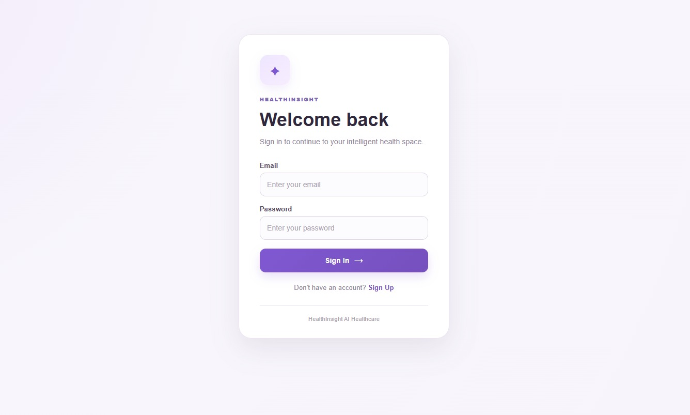
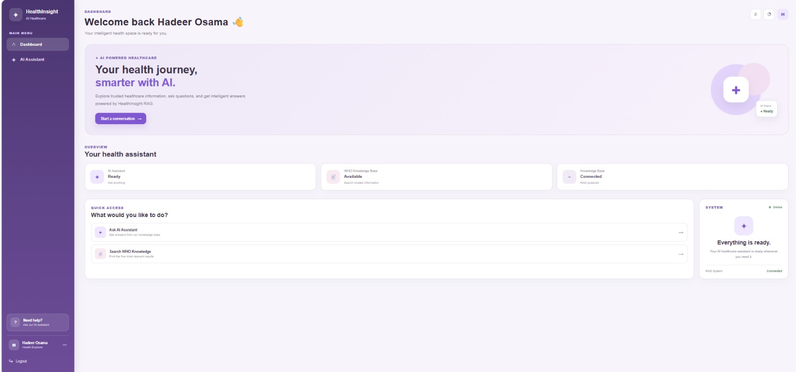
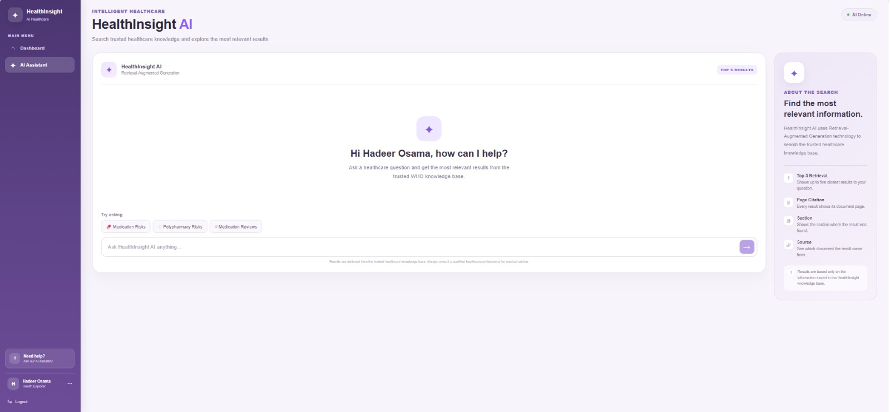

# 🩺 MedSafe RAG

### Citation-Grounded RAG Chatbot for Medication Safety based on WHO Guidelines

MedSafe RAG is a Citation-Grounded Retrieval-Augmented Generation (RAG) chatbot designed to help users retrieve reliable information about **Medication Safety in Polypharmacy** from the World Health Organization (WHO) guidelines.

The system allows users to ask questions in natural language and receive answers grounded in the retrieved content from the WHO document, together with **source and page references** for better traceability and transparency.

---

## 📸 Screenshots

### 🔐 Login



---

### 🏠 Dashboard



---

### 🤖 AI Assistant


## 🎯 Project Overview

Medication-related information can be difficult and time-consuming to find in long medical documents.

MedSafe RAG addresses this problem by combining:

- Semantic Search
- Retrieval-Augmented Generation
- Vector Database Retrieval
- Large Language Models
- Citation-Based Answers

Instead of generating answers only from the language model's internal knowledge, the system first retrieves relevant information from the WHO document and then uses the retrieved context to generate a grounded response.

---

## 🏥 Problem

Medication safety becomes more challenging when patients use multiple medications simultaneously, a situation known as **polypharmacy**.

Healthcare professionals and researchers may need to search through long medical documents to find specific information about:

- Medication safety
- Polypharmacy
- Medication-related risks
- Safe medication practices
- Recommendations and guidance

Searching manually through long documents can be slow and inefficient.

---

## 💡 Solution

MedSafe RAG provides an interactive AI assistant that allows users to ask questions using natural language.

The system:

1. Receives the user's question.
2. Converts the question into an embedding.
3. Searches the vector database for semantically relevant document chunks.
4. Retrieves the most relevant information from the WHO document.
5. Sends the retrieved context to the LLM.
6. Generates a grounded answer.
7. Provides source and page information for traceability.

---

## ⭐ Key Features

- 🔎 **Semantic Retrieval**  
  Finds relevant information based on meaning rather than exact keyword matching.

- 📚 **WHO-Based Knowledge Base**  
  The knowledge base is built from the WHO document on Medication Safety in Polypharmacy.

- 🤖 **RAG-Based AI Assistant**  
  Combines document retrieval with an LLM to generate contextual answers.

- 📌 **Source & Page Citations**  
  Answers include document source and page information to improve traceability.

- 🛡️ **Grounded Responses**  
  The system is designed to generate answers based on retrieved evidence rather than relying only on the model's internal knowledge.

- 💬 **Interactive Chat Interface**  
  Users can communicate with the AI assistant through a simple web interface.

- 🔐 **Authentication Interface**  
  The frontend includes Login and Signup pages.

- 📊 **Dashboard**  
  Provides a central interface for accessing the application.

- 🚫 **Reference-Heavy Chunk Filtering**  
  Reference-heavy content is filtered to improve retrieval quality.

---

## 🧠 How the RAG System Works

The overall pipeline can be summarized as:

```text
                User Question
                      │
                      ▼
              Query Embedding
                      │
                      ▼
              Semantic Retrieval
                      │
                      ▼
                 ChromaDB
                      │
                      ▼
            Relevant WHO Chunks
                      │
                      ▼
               Context Building
                      │
                      ▼
              Ollama LLM
             llama3.2:latest
                      │
                      ▼
            Grounded AI Answer
                      │
                      ▼
          Source + Page Citation
📖 Knowledge Source

The main knowledge source used by the system is:

World Health Organization (WHO)

Document:

WHO-UHC-SDS-2019.11-eng.pdf

The document focuses on:

Medication Safety in Polypharmacy

The PDF is processed into smaller chunks before being stored in the vector database.

✂️ Chunking Strategy

The WHO document is divided into smaller meaningful text chunks to make semantic retrieval more effective.

The retrieved chunks are then used as the context for the language model.

The project also applies filtering logic to avoid retrieving chunks that are mainly composed of references or bibliography content.

🔍 Retrieval

The system uses semantic similarity search to retrieve relevant chunks from the vector database.

Embedding Model
sentence-transformers/all-MiniLM-L6-v2

The embedding model converts both the user's query and document chunks into numerical vector representations.

This allows the system to compare semantic similarity between the question and stored document content.

🗄️ Vector Database

The project uses:

ChromaDB

The ChromaDB database stores the embeddings and associated document metadata.

Collection
who_medication_safety_day1
Indexed Chunks
227 chunks

The metadata can be used to maintain information such as document source, section, and page references.

🤖 Large Language Model

The project uses:

Ollama

with:

llama3.2:latest

The LLM receives the retrieved WHO context and the user's question, then generates the final grounded response.

⚙️ Backend

The backend is implemented using:

Python
Flask
Main Backend Files
Backend/
├── app.py
├── rag.py
├── build_database.py
├── check_metadata.py
├── WHO-UHC-SDS-2019.11-eng.pdf
└── chroma_db/
API

The Flask backend provides a chat endpoint:

/api/chat

The frontend sends the user's question to this endpoint and receives the generated response.

🎨 Frontend

The frontend is implemented using:

React
Vite
CSS

The application includes:

Frontend/
├── public/
├── src/
│   ├── assets/
│   ├── pages/
│   │   ├── AIAssistant.jsx
│   │   ├── Dashboard.jsx
│   │   ├── Login.jsx
│   │   └── Signup.jsx
│   ├── App.jsx
│   ├── App.css
│   ├── index.css
│   └── main.jsx
├── package.json
└── vite.config.js
🖥️ Application Pages
Login

Allows users to access the application through the authentication interface.

Signup

Provides a registration interface for new users.

Dashboard

Acts as the main application interface and provides access to the AI assistant.

AI Assistant

The main RAG chatbot interface where users can ask medication-safety questions and receive grounded answers with citations.

🔗 Frontend–Backend Architecture

The application follows a client-server architecture:

React Frontend
      │
      │ HTTP Request
      ▼
Flask Backend
      │
      ▼
RAG Pipeline
      │
      ├── Query Embedding
      ├── ChromaDB Retrieval
      ├── Context Filtering
      └── Ollama LLM
      │
      ▼
Grounded Response
      │
      ▼
React AI Assistant
📊 Evaluation & Quality

The project focuses on two important areas of RAG evaluation:

1. Retrieval Quality

The retrieval process is evaluated based on:

Relevance of retrieved chunks
Top-k retrieval quality
Retrieval precision
Chunking strategy
Embedding model selection
Relevance of retrieved content to the actual clinical question
2. Answer Grounding & Faithfulness

The generated answers are evaluated based on:

Whether the answer is supported by retrieved evidence
Citation accuracy
Source traceability
Reduction of unsupported claims
Faithfulness to the retrieved WHO content
🛡️ Faithfulness & Traceability

A key objective of MedSafe RAG is to make the generated answers more transparent and traceable.

Instead of presenting an unsupported AI-generated response, the system provides information about the source and page associated with the retrieved evidence.

This allows users to verify the information against the original WHO document.

🧰 Technology Stack
Component	Technology
Frontend	React
Build Tool	Vite
Styling	CSS
Backend	Python
API Framework	Flask
Vector Database	ChromaDB
Embeddings	all-MiniLM-L6-v2
LLM	Ollama
LLM Model	llama3.2:latest
Knowledge Source	WHO Medication Safety in Polypharmacy
Version Control	Git & GitHub
📁 Project Structure
MedSafe-RAG/
│
├── Backend/
│   ├── app.py
│   ├── rag.py
│   ├── build_database.py
│   ├── check_metadata.py
│   ├── WHO-UHC-SDS-2019.11-eng.pdf
│   └── chroma_db/
│
├── Frontend/
│   ├── public/
│   ├── src/
│   │   ├── assets/
│   │   │   ├── login.png.jpeg
│   │   │   ├── dashboard.png.jpeg
│   │   │   └── ai-assistant.png.jpeg
│   │   ├── pages/
│   │   │   ├── AIAssistant.jsx
│   │   │   ├── Dashboard.jsx
│   │   │   ├── Login.jsx
│   │   │   └── Signup.jsx
│   │   ├── App.jsx
│   │   ├── App.css
│   │   ├── index.css
│   │   └── main.jsx
│   ├── package.json
│   └── vite.config.js
│
├── AI_Clinical_Decision_Support_RAG_Documentation_Final.docx
├── AI_Day1_Day3_Chatbot (1).ipynb
├── Polypharmacy_RAG_Chatbot_EDITED (5).pptx
├── README.md
└── .gitignore
🚀 How to Run the Project
1. Clone the Repository
git clone git@github.com:Hosamaaaa-10/MedSafe-RAG.git

Then:

cd MedSafe-RAG
⚙️ Backend Setup

Go to the Backend directory:

cd Backend

Create and activate a virtual environment if needed:

python -m venv venv

On Windows:

venv\Scripts\activate

Install the required Python packages according to the project environment.

Then make sure Ollama is running and the required model is available:

llama3.2:latest

Start the Flask backend:

python app.py

The backend runs on:

http://127.0.0.1:5000
🎨 Frontend Setup

Open another terminal and go to:

cd Frontend

Install dependencies:

npm install

Start the Vite development server:

npm run dev

Then open the local URL provided by Vite in your browser.

🔄 RAG Pipeline Configuration

The project uses the following core configuration:

Embedding Model:
sentence-transformers/all-MiniLM-L6-v2

Vector Database:
ChromaDB

Collection:
who_medication_safety_day1

LLM:
Ollama

Model:
llama3.2:latest

Backend:
Flask

Frontend:
React + Vite
🎯 Project Goals

The main goals of MedSafe RAG are to:

Make medical information easier to retrieve.
Reduce the time required to search long medical documents.
Provide answers grounded in an authoritative source.
Improve transparency through citations.
Demonstrate a practical RAG architecture for healthcare information retrieval.
Provide an interactive and user-friendly AI assistant.
⚠️ Disclaimer

MedSafe RAG is an educational and research-oriented project based on the referenced WHO document.

It is not intended to replace professional medical judgment, diagnosis, or treatment.

Users should consult qualified healthcare professionals for clinical decisions.

📌 Future Improvements

Possible future improvements include:

More comprehensive RAG evaluation datasets.
Improved retrieval ranking and reranking.
Support for additional trusted medical sources.
More advanced citation visualization.
Improved authentication and user management.
Conversation history.
Multi-document retrieval.
More detailed evaluation metrics.
👥 Project

MedSafe RAG

Citation-Grounded RAG Chatbot for Medication Safety based on WHO Guidelines.

Built using:

React + Flask + ChromaDB + Sentence Transformers + Ollama


## 👥 Team Members

- Hadeer Osama
- Arwa Sameh
- Shahd Abdelnaby
- Hadeer Abdalsattar
